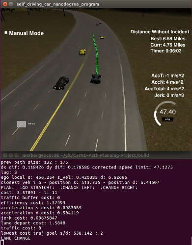
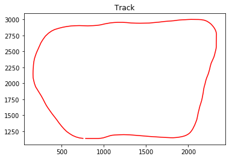
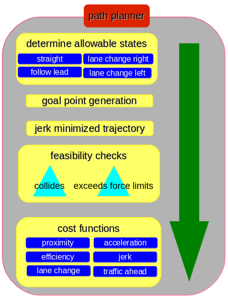

# Motion Path Planning - Highway Driving
## Self-Driving Car Engineer Nanodegree Program

The goal of this project is to safely navigate around a virtual highway with other traffic that is driving +-10 MPH of the 50 MPH speed limit.

The planning algorithm makes use of States and Jerk Minimized Trajectories in Frenet space.

It requires Udacity's "Term3" version of the simulator, available [here](https://github.com/udacity/self-driving-car-sim/releases).

This is part of a series of projects exploring different methods to autonomously drive a car around a simulated track. Others are:
* [MPC Control](https://github.com/merbar/CarND-MPC-Project)
* [PID Control](https://github.com/merbar/CarND-PID-Control-Project)
* [Deep Learning](https://github.com/merbar/CarND-Behavioral-Cloning-P3)

## Result: [YouTube video: Path Planning (2x timelapse)](https://www.youtube.com/watch?v=enjdlzo3z2M)

### Screenshot with debugging output



## Structure

The project has four distinct pieces and, unless otherwise noted, where my contribution.
- **main.cpp:** Provided by Udacity to communicate with their simulator. Extended with everything related to the path planner as well as a custom getXY() function which works with splines. Also contains pre- and post-processing steps of data and planned paths.
- **polyTrajectoryGenerator class:** Everything related to the generation and evaluation of trajectories in Frenet space
- **Vehicle class:** Holds basic position, velocity and acceleration data for ego vehicle and other traffic
- **Polynomial class:** Used to further process jerk minimized trajectories. Contains functions to get three levels of derivatives (down to jerk) at a given future timestep.

I am making heavy use of the spline fitting functions from http://kluge.in-chemnitz.de/opensource/spline/ in spline.h.

## Project Overview

The ~6.5km long track goes in a circle and is filled by a random population of AI-controlled vehicles. Each vehicle travels at a random speed and avoids collisions with slower traffic by reducing speed or changing lanes.

Provided are waypoints along the track as well as synthetic localization and sensor fusion data sent from the simulator. Data is in X/Y world space coordinates as well as Frenet S/D. Sensor fusion data contains position and velocity information of the twelve closest vehicles in travel direction.

**Plot of track**  


The car uses a perfect controller and will visit every (x,y) point it receives in a list every .02 seconds.

### Local Space Generation

While it would be feasible in this particular case, dealing with the entire world at once is not practical. Additionally, it would have required special attention to ensure a smooth transition when the tracks loops back on itself.

Instead, I am generating a local space from the closest 30 waypoints. I am fitting splines in relation to S for X, Y, dX and dY - these find their main use in my conversion function from Frenet to Cartesian space and enable the car to follow the curvature of the road properly and jerk-free.

### States / Decision Making

With highway driving being a fairly controlled environment, the path planner has only four distinct states ("go straight", "follow lead vehicle", "lane change left", "lane change right"). Based on allowed state at each update step, goal points are generated, further perturbed to add potentially more efficient variations, and finally turned into jerk-minimized trajectories.

These trajectories are then evaluated for feasibility (no collisions, does not exceed speed limit, etc). Feasible trajectories are then given a weighted cost with the "cheapest" trajectory becoming the output of the path planner. 

It became slightly tricky when trying to get accurate start states for velocity and acceleration to generate feasible trajectories. The path planning happens in Frenet coordinates and the simulator does not send accurate velocity and acceleration for the s and d components. Conversions from X/Y to Frenet is very susceptible to tiny inaccuracies and not useable. Instead - keeping in mind that the vehicle follows the exact input the planner gives it - I am simply storing the state of the vehicle at my **future** update step and pick it up during the next cycle as velocity/acceleration start state to my jerk-minimized trajectory generator.

**Path planner outline**  


### Lag Compensation / Path Smoothing

Since the vehicle "teleports" around the track based on an exact input of X/Y coordinates, it is very susceptible to small discontinuities in the planned path - this is amplified by lag between the simulator and path planner. In my case, the lag is between one and four cycles at 0.02 seconds.

To come up with a new, smooth path at each update interval I do the following:
- reuse the next element in previous_path
- for each successive point, add deltas in x/y of my new path
This adds a neglibible error of no more than the distance the car travels in one timestep (0.02s).

Additionally, I smooth the resulting path with previous_path for 20 timesteps to get rid of any remaining discontinuities.

## Special case treatment

#### Car getting stuck behind traffic in two neighboring lanes

While goal points are only generated for the current and neighboring lanes, we still need to observe traffic across all three lanes. If the car is stuck behind slower traffic in an outside lane - with equally slow traffic in the center lane and open road in the opposing one, the path planner is "nudged" to move the vehicle into the center lane. From there, it will correctly plan the move into the open lane. The "nudging" is achieved by reducing costs of a lane change that gets us closer to the open lane.

#### Planner would sometimes revoke in-progress lane changes

I observed situations where a lane change was planned, but immediately revoked on the next update cycle. For the most part, this was actually the more efficient thing to do and was perfectly feasible. It is not however a behavior we want to see in real traffic - so in order to force the full execution of a smooth lane change, I am stopping updates to the path planner for a slighly longer period of time once it enters the "lane change" state.

#### Emergency Brake Assist

Traffic sometimes "cuts off" our vehicle by making aggressive lane changes. If a collision is imminent and can't be corrected by the path planner, it switches into an emergency mode and forces a hard braking maneuver. It ignores comfort limits for decceleration force, shortens path update intervals and disallows lane changes (which are dangerous combined with the hard braking). Once a safe distance is reestablished, the planner switches back into normal mode.

#### Undesirable acceleration when making left turns in the outside lanes

This is a side effect of working in Frenet space combined with our perfect controller. Frenet s-coordinates are based on the center median of he highway. During tight turns in the outside right lane, we actually cover more distance in world space than what was planned for in Frenet. For simplicity, I reduce the input speed to the path planner based on the curvature of the road ahead.


## Basic Build Instructions

1. Clone this repo.
2. Make a build directory: `mkdir build && cd build`
3. Compile: `cmake .. && make`
4. Run it: `./path_planning`.

---

## Dependencies

* cmake >= 3.5
 * All OSes: [click here for installation instructions](https://cmake.org/install/)
* make >= 4.1
  * Linux: make is installed by default on most Linux distros
  * Mac: [install Xcode command line tools to get make](https://developer.apple.com/xcode/features/)
  * Windows: [Click here for installation instructions](http://gnuwin32.sourceforge.net/packages/make.htm)
* gcc/g++ >= 5.4
  * Linux: gcc / g++ is installed by default on most Linux distros
  * Mac: same deal as make - [install Xcode command line tools]((https://developer.apple.com/xcode/features/)
  * Windows: recommend using [MinGW](http://www.mingw.org/)
* [uWebSockets](https://github.com/uWebSockets/uWebSockets)
  * Run either `install-mac.sh` or `install-ubuntu.sh`.
  * If you install from source, checkout to commit `e94b6e1`, i.e.
    ```
    git clone https://github.com/uWebSockets/uWebSockets 
    cd uWebSockets
    git checkout e94b6e1
    ```

